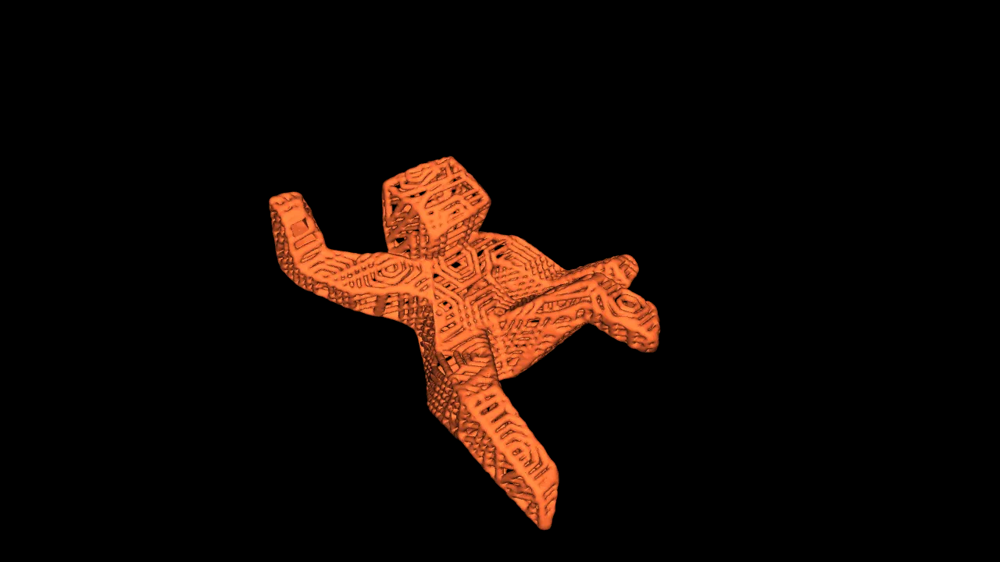

<div align="center">



# Rocky

A desktop assistant for understanding neural network architectures — paper-grounded, not generic.

Short sentences. No filler. Dry humour. Unexpected tenderness when you're lost in tensor shapes.

</div>

<!-- Drop an app screenshot at docs/screenshot.png and uncomment below -->
<!--  -->

## Why

Ask any LLM *"why is this 1×1 Conv here?"* and you'll get a textbook answer about pointwise convolutions. Useful. Generic.

Rocky is different. It detects known architectural motifs in your model (inverted residuals, SE blocks, attention heads, etc.), attaches curated paper-grounded rationale, and feeds all of that to the LLM of your choice as context. The model's actual shapes, attributes, and topology are ground truth — no hallucination. The answers you get are about **your specific model**, not convnets in general.

## Features

- **Open any ONNX file.** Native file dialog. No uploads. Parses with shape inference, renders as an interactive graph.
- **Click-to-inspect.** Every node shows inputs, outputs, weights, attributes, and connections in a clean side panel.
- **Chat with Rocky in the same window.** Pick your LLM — Anthropic, OpenAI, or Gemini. Your API key stays on your machine (OS keyring, never plaintext).
- **Motif detection.** Rocky recognises architectural patterns and injects the paper citation + design rationale into the conversation context. Your LLM answers with specifics, not platitudes.
- **Dark workspace aesthetic.** Deep charcoal, xenonite amber accents, subtle mascot.

## What Rocky sounds like

Rocky talks the way his namesake works: compressed, precise, zero filler. A real exchange looks roughly like this:

> **You:** hey rocky
>
> **Rocky:** *fist bump* MobileNetV2. 209 nodes. 3.5M params. Ready.
>
> **You:** why such a big expand ratio on this block?
>
> **Rocky:** Inverted residual. Expansion 6×. Standard MobileNetV2.
> Low-dim manifold stays thin. Conv happens wide. Project back linear —
> ReLU on the thin tensor would kill information.
> Sandler 2018, §3.3.

No "Great question!" No preamble. Numbers are exact. When a pattern is standard, Rocky names it. When it's unusual, he says so.

## Quick start

### Prerequisites

- Python 3.10+
- Node.js 20+
- Rust 1.85+ (via [rustup](https://rustup.rs))
- On Windows: Microsoft C++ Build Tools (for Tauri)

### Install the backend

```bash
pip install -e .
```

This registers a `rocky-backend` CLI that the desktop app launches as a sidecar.

### Install frontend deps

```bash
cd rocky/ui
npm install
```

### Run in dev mode

```bash
cd rocky/ui
npx tauri dev
```

First launch compiles Tauri + downloads webview bindings (~3–5 min). Subsequent launches are fast.

### Build a release binary

```bash
cd rocky/ui
npx tauri build
```

**Output locations** (under `rocky/ui/src-tauri/target/release/bundle/`):

| Platform | Artifact          | Path                                        |
| -------- | ----------------- | ------------------------------------------- |
| Windows  | MSI installer     | `msi/Rocky_<version>_x64_en-US.msi`         |
| Windows  | NSIS setup .exe   | `nsis/Rocky_<version>_x64-setup.exe`        |
| macOS    | .app bundle       | `macos/Rocky.app`                           |
| macOS    | .dmg installer    | `dmg/Rocky_<version>_<arch>.dmg`            |
| Linux    | AppImage          | `appimage/rocky_<version>_amd64.AppImage`   |
| Linux    | .deb package      | `deb/rocky_<version>_amd64.deb`             |

> **Cross-compilation note:** Tauri builds target-native, so a macOS `.app` / `.dmg` must be built on a Mac, and Linux packages on Linux. A GitHub Actions workflow at [`.github/workflows/release.yml`](.github/workflows/release.yml) builds all three platforms automatically — tag a release with `git tag v0.x.y && git push --tags` and GitHub produces artifacts for Windows, Apple Silicon, Intel Mac, and Linux in one run.

## First-time setup

1. Click the **gear icon** in the toolbar.
2. Pick a provider (Anthropic / OpenAI / Gemini), paste your API key, save.
3. Your key goes to your OS's secret store — Windows Credential Manager, macOS Keychain, or Linux Secret Service. Never written to disk as plaintext.
4. Close settings. Click **Open Model**, pick an `.onnx` file.
5. Click any node. Ask Rocky why it's there.

Switching providers later: just open settings and flip the active one. Per-provider model selection (Opus vs Sonnet, GPT-4o vs mini, etc.) persists.

## Architecture

```
┌─────────────────────────────────────────────────┐
│  Tauri desktop shell (Rust)                     │
│  - window management                            │
│  - spawns Python sidecar on startup             │
│  - OS keyring bridge (save/get/delete API keys) │
│  - file dialog, shell plugins                   │
├─────────────────────────────────────────────────┤
│  React webview (TypeScript, Vite)               │
│  - ReactFlow + Dagre graph renderer             │
│  - NodeInspector panel                          │
│  - ChatPanel with streaming SSE reader          │
│  - Settings modal                               │
├─────────────────────────────────────────────────┤
│  Python backend sidecar (FastAPI, uvicorn)      │
│  - ONNX parser with shape inference             │
│  - Motif detector + curated knowledge base      │
│  - LLM adapters (Anthropic / OpenAI / Gemini)   │
│  - SSE streaming endpoint                       │
└─────────────────────────────────────────────────┘
```

The Python sidecar binds to `127.0.0.1:6070`. Everything is localhost. Nothing calls home.

## Repo layout

```
rocky/
├── cli.py                      # Backend entry point (rocky-backend)
├── parsers/
│   └── onnx_parser.py          # ONNX → NodeDetail / ModelSummary
└── server/
    ├── model_state.py          # Singleton state (model, motifs, selection)
    ├── rest_api.py             # FastAPI endpoints
    ├── chat.py                 # Multi-provider streaming adapters
    └── motifs.py               # Pattern detector + knowledge base

rocky/ui/
├── src/
│   ├── App.tsx                 # Layout + routing
│   ├── components/             # Graph, Inspector, ChatPanel, Settings, Mascot, Toolbar
│   ├── hooks/                  # useModel, useChat, useProviderConfig, useSelectedNode
│   ├── lib/                    # providers catalogue, secrets wrapper
│   └── styles/rocky.css        # Theme tokens + animations
└── src-tauri/
    ├── Cargo.toml
    ├── tauri.conf.json
    ├── capabilities/default.json
    └── src/
        ├── main.rs
        ├── lib.rs              # Sidecar lifecycle, plugin setup
        └── secrets.rs          # Keyring-backed API key commands
```

## REST API

| Endpoint | Purpose |
|----------|---------|
| `POST /api/load` | Parse a model from a filesystem path |
| `GET /api/summary` | Model name, node count, params, op histogram |
| `GET /api/graph` | Full node + edge list for rendering |
| `GET /api/node?name=…` | Full detail for one node (shapes, attrs, connections, motifs) |
| `GET /api/motifs` | All detected motifs + node index + knowledge base |
| `POST /api/chat` | SSE stream of tokens from the active LLM provider |
| `GET /api/health` | Heartbeat + loaded-model status |

## Tauri commands (Rust → JS)

| Command | Purpose |
|---------|---------|
| `save_api_key(provider, key)` | Store in OS keyring |
| `get_api_key(provider)` | Retrieve for LLM call |
| `delete_api_key(provider)` | Remove key + de-register provider |
| `peek_api_key(provider)` | Return masked preview (last 4 chars) for UI |
| `get_config` / `set_active_provider` / `set_active_model` | Non-secret state in `~/.rocky/config.json` |

## Adding a new motif

1. Write a detector function in [`rocky/server/motifs.py`](rocky/server/motifs.py):
   ```python
   def detect_se_block(state: ModelState) -> list[Motif]:
       # walk the graph, match the pattern, return a list of Motif(...)
       ...
   ```
2. Register it in `DETECTORS`.
3. Add a curated entry to `KNOWLEDGE`:
   ```python
   "se_block": {
       "title": "Squeeze-and-Excitation",
       "paper": "Hu et al., CVPR 2018",
       "rationale": "…",
       ...
   }
   ```
4. Reload a model. If your detector is correct, the motif shows up in `GET /api/motifs` and gets injected into Rocky's chat context automatically.

## Adding a new LLM provider

1. Add an entry to `PROVIDERS` in [`rocky/ui/src/lib/providers.ts`](rocky/ui/src/lib/providers.ts) (id, label, model list, key placeholder).
2. Add a `_stream_xxx` adapter in [`rocky/server/chat.py`](rocky/server/chat.py) that speaks that provider's native streaming format and yields unified `{token: "..."}` / `{done: true}` / `{error: "..."}` events.
3. Dispatch it in `stream_chat`.

## Privacy and security

- **API keys:** Stored in your OS's secret store (keyring crate on Rust side). Not synced anywhere. Removed when you click Remove in settings, or by deleting the entry in Credential Manager / Keychain.
- **Model data:** Never leaves `127.0.0.1`. The Python sidecar is the only thing that parses your `.onnx`.
- **LLM calls:** Go directly from the Python sidecar to the provider's API using the key you pasted. Rocky doesn't proxy through any third-party server.
- **Telemetry:** None. There is no analytics SDK.

## Roadmap

- **More motifs.** SE, residual bottleneck, multi-head attention, FFN, depthwise separable, residual stem, LayerNorm.
- **Per-model notes.** `~/.rocky/notes/<model_hash>/` — user annotations Rocky remembers across sessions ("this block is our custom quantization scheme").
- **UI motif highlighting.** Cluster amber outlines on the graph, "Part of X" badge in the inspector, click-to-select-entire-motif.
- **Tool-calling for chat.** Rocky asks the backend for weight statistics / subgraph queries mid-conversation instead of relying on pre-loaded context.
- **More formats.** TensorFlow SavedModel, TorchScript, TFLite, SafeTensors.
- **Release installers.** Signed `.msi` / `.dmg` / `.AppImage` builds.

## Troubleshooting

**"No matching entry found in secure storage"** — your keyring entry got lost. Open settings, remove the provider, re-add the key.

**"Backend did not respond"** — `rocky-backend` didn't start. Confirm `pip install -e .` ran in the Rocky project root; verify `rocky-backend --help` works in your terminal.

**Linux headless servers have no Secret Service daemon.** The keyring backend will fail silently. Planned fallback: prompt for an env var.

## License

[MIT](LICENSE) © 2026 Devansh Shukla. Use it, fork it, modify it, ship it — just keep the copyright notice.

---

<div align="center">


<sub>Named after the alien engineer from Andy Weir's <em>Project Hail Mary</em>.</sub>

</div>

---

Built as a workspace for the deep-context kind of questions, not the chat-with-your-files kind.
